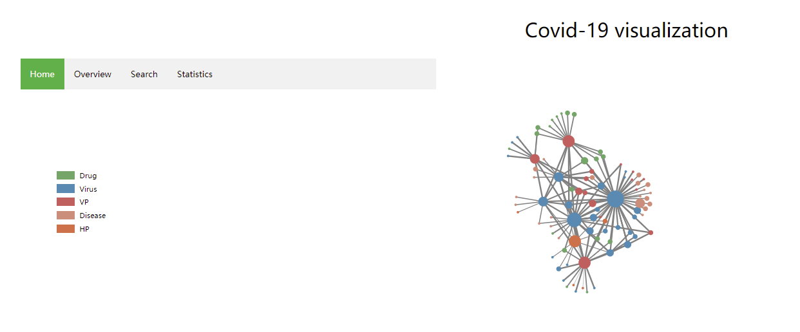

## Introduction 
This Porject implements a visualization of Knowledge Graph on COVID-19 using Neo4j and Node.js 
* Authors: *Wei JIANG, Yijun LU, Zijie LIU*
The demo shows the relationship between entities appeared in Bioxiv.org papers related to COVID-19

## Dependencies
* [Node4j](https://https://neo4j.com/) >= 4.0.11
* [JAVA](https://www.java.com) >= 11
* [Node.js]

```sh
npm install
npm install webpack
```

## Running the Demo
```sh
neo4j console
npm start
```
go to localhost:8080/visualization and this page would appear 
Screenshot:  



